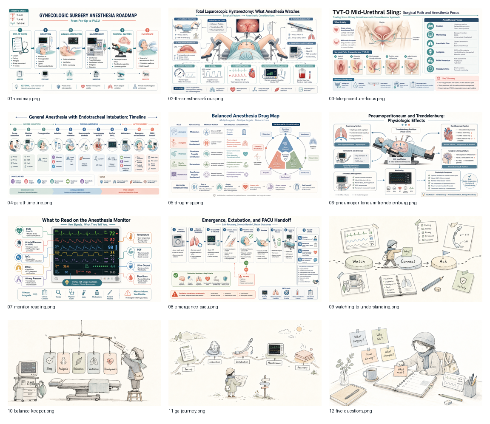

# Anesthesia Teaching Courseware

Repository name: `anesthesia-teaching-courseware`

Live site: <https://2023anita.github.io/anesthesia-teaching-courseware/>

This repository collects bilingual HTML teaching modules for introductory anesthesia observation.

The project started from a practical teaching need: I was preparing to mentor a first-year Cornell University student who is interested in anesthesiology but does not yet have an accessible, visual, beginner-friendly set of learning materials. Many anesthesia resources are either written for clinicians who already know the operating room, or they are too text-heavy for a first exposure. These modules try to sit in the middle: clinically grounded, visual, concise, and usable before, during, or after an operating-room observation day.

The materials are created with a clinician-in-the-loop workflow. I provide the clinical context and teaching goals, then use AI tools to help draft bilingual explanations, generate medical infographics, create hand-drawn concept illustrations, and package everything into self-contained HTML course pages. Each page is intended to make one anesthesia scenario easier to understand, not to replace formal textbooks, local protocols, or clinician judgment.

## Goals

- Help early learners understand what anesthesiologists watch, decide, and protect during surgery.
- Make bilingual, illustrated anesthesia teaching materials easier to access.
- Share a practical example of how AI can support clinician-led medical education.
- Invite students, clinicians, educators, and technically curious readers to learn from and improve the materials.

## Course Modules

| Module | Focus | Open |
|---|---|---|
| Gynecologic Surgery Anesthesia | Total laparoscopic hysterectomy, TVT-O, general anesthesia with endotracheal intubation | [Open course](gyne-anesthesia-course/index-standalone.html) |
| Hemifacial Spasm MVD Anesthesia | Microvascular decompression, general anesthesia, nerve monitoring, smooth emergence | [Open course](hfs-mvd-anesthesia-course/index-standalone.html) |
| Cesarean Delivery and High-Risk Obstetric Anesthesia | Cesarean anesthesia, placenta previa / PAS, gestational hypertension, gestational diabetes, advanced maternal age | [Open course](obstetric-cesarean-anesthesia-course/index-standalone.html) |
| Hysteroscopic Surgery Anesthesia | Uterine polyp / abnormal uterine bleeding, general anesthesia, distension fluid, fluid deficit, ambulatory recovery | [Open course](hysteroscopy-anesthesia-course/index-standalone.html) |
| ENT Pediatric Anesthesia | Shared airway, pediatric airway differences, adenoid hypertrophy, tonsillar / laryngeal lesions, vocal cord polyp, smooth emergence | [Open course](ent-pediatric-anesthesia-course/index-standalone.html) |
| Japanese Handdrawn Illustrations Skill Course | How to use a Codex illustration skill and fork the GitHub project into your own reusable visual system | [Open course](japanese-handdrawn-course/index.html) |
| Scientific Visual Skills Course | How to use scientific visual skills for infographics, cover visuals, and publication-style mechanism figures, then fork the project into your own workflow | [Open course](scientific-visual-skills-course/index.html) |

## What Is Included

The homepage is designed as a courseware portfolio, not a generic project landing page. It shows:

- a visual cover area with selected figures from the clinical teaching sets;
- course cards that open the standalone HTML modules;
- a short explanation of the clinician-led, AI-assisted workflow;
- boundaries that make clear these pages are teaching aids, not clinical protocols.

## How to Use

Each module can be opened directly in a browser. The standalone HTML files include embedded images, so they can be shared as single files or hosted on GitHub Pages without losing figures.

Suggested use:

1. Review the roadmap before entering the operating room.
2. Use the visual figures to explain key concepts during quiet moments.
3. After the case, use the debrief questions to connect observation with anesthesia reasoning.

## Disclaimer

These materials are for introductory teaching and observation. They do not provide patient-specific medical advice, drug dosing protocols, or clinical directives. They do not replace hospital policies, anesthesia records, attending physician judgment, or formal medical training.

## 中文说明

这个仓库用于整理一组中英双语 HTML 麻醉见习课件。项目起点很具体：我需要带教一名来自 Cornell University、对麻醉学感兴趣的大一学生，但入门阶段很缺少那种图文并茂、适合手术室见习前后使用的材料。

这些课件希望把临床麻醉中的关键问题讲得更清楚：麻醉医生为什么这样评估、为什么选择某种麻醉方式、术中在看什么、遇到高风险情况时怎样提前准备。它们不是临床指南，也不提供固定剂量方案，而是面向初学者的视觉化学习材料。

我希望这个项目能让更多对麻醉学、围术期医学和医学教育感兴趣的人参与学习，也展示一种务实的 AI 辅助医学教学工作流：由临床医生提出教学目标，AI 协助生成图文材料和网页课件，再由人进行审核和迭代。
